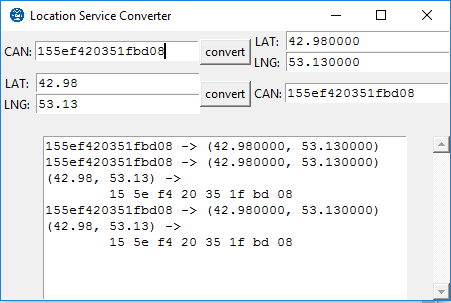
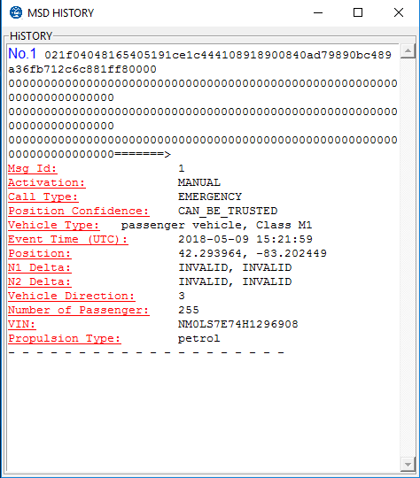
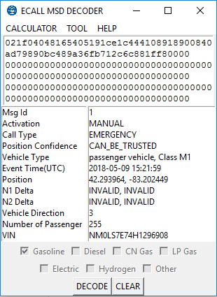

# eCall MSD Decoder
A GUI based on Python Tkinter to decode MSD (Minimum Set of Data). There are few MSD decoders on the Internet so I create this tool for anyone who are interested in eCall and MSD.

## Introduction
eCall is a pan-European in-vehicle emergency call system which uses the European emergency
number 112 over a cellular network in the event of an accident. An eCall can be placed manually, e.g., on
the push of a button, or automatically upon detection of an emergency situation by the car's safety
systems, e.g., due to airbag deployment.

The Minimum Set of Data (MSD) contains vehicle information such as location, vehicle
identification number, etc. The expected benefit is that emergency services will be made aware of
accidents rapidly, will get precise location information and therefore will be able to reach accident victims
faster, with the potential to save many hundreds of lives annually. 

## Description
### Menu
* CALCULATOR: A lots of useful web links to help your calculations.
* TOOL: 
  * Location Service Converter: Convert CAN GNSS signals to readable LAT/LNG and vice versa.
  
  
  * MSD History: Stores your MSD Decode history.
  
  
* HELP: GUIDE and ABOUT the program.

### MSD Entry Box
An entry box where you can copy and paste the raw MSD data.

### Decode List Area
A list box where shows detail values after decoding raw MSD data.

### Operation Buttons
Two buttons: Decode raw MSD data and clear everything.

## GUI

